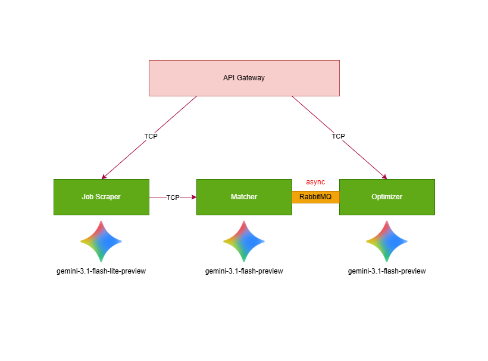

# Resume to Job Matcher



Resume to Job Matcher is a production-style NestJS monorepo that helps candidates understand how well a resume aligns with a target role, then generates actionable recommendations to close skill gaps.

The platform combines synchronous APIs and asynchronous microservice workflows:

- API Gateway exposes authenticated HTTP endpoints.
- Job Scraper extracts structured job requirements from a URL or raw text.
- Matcher compares resume content against job requirements and calculates a match score.
- Optimizer creates personalized project ideas and certification recommendations based on detected gaps.

## Table of Contents

- [Project Overview](#project-overview)
- [Core Functionalities](#core-functionalities)
- [Architecture](#architecture)
- [Services and Responsibilities](#services-and-responsibilities)
- [API Reference](#api-reference)
- [Message Contracts](#message-contracts)
- [Data Model](#data-model)
- [Tech Stack](#tech-stack)
- [Local Setup](#local-setup)
- [Environment Variables](#environment-variables)
- [Run with Docker Compose](#run-with-docker-compose)
- [Run in Local Dev Mode](#run-in-local-dev-mode)
- [Testing and Quality](#testing-and-quality)
- [Operational Notes](#operational-notes)

## Project Overview

This project is designed to automate a complete resume-analysis pipeline:

1. A user signs up and logs in.
2. The user uploads a PDF resume.
3. The system extracts job requirements from a job posting URL or pasted text.
4. The resume is matched against the job requirements to produce:
   - Compatibility score (0-100)
   - Matched skills
   - Missing skills
   - Candidate-facing summary
5. Missing-skill insights are published as an event.
6. The optimizer consumes that event and generates career recommendations:
   - Project ideas
   - Relevant certifications

## Core Functionalities

### 1) Authentication and User Context

- JWT-based authentication with signup/login flows.
- Passwords are hashed with bcrypt.
- Protected endpoints use a JWT auth guard.
- `GET /auth/me` returns the authenticated user context.

### 2) Resume Upload and Storage

- Users upload PDF resumes via multipart form-data.
- Files are stored in MinIO (S3-compatible object storage).
- Resume metadata is persisted in PostgreSQL (Prisma).
- The stored resume ID is used as the main key for downstream matching.

### 3) Job Description Extraction

- Supports either:
  - `url` (HTML is fetched and cleaned), or
  - `rawText` (direct pasted content).
- Cheerio removes page clutter and extracts plain text from job pages.
- Gemini transforms unstructured text into a normalized JSON job description.

### 4) Match Scoring and Gap Analysis

- Resume PDF is fetched from MinIO and parsed to text.
- Gemini compares resume content vs. job requirements.
- Output includes:
  - `score`
  - `matchedSkills`
  - `missingSkills`
  - `summary`
- Match summaries are normalized to directly address the candidate and start with "You are".
- Match results are written to PostgreSQL.
- Result payload is cached in Redis for one hour.

### 5) Event-Driven Optimization

- After match completion, matcher emits a `gap_analysis_ready` event to RabbitMQ.
- Optimizer consumes the event and generates personalized recommendations:
  - 3 to 5 portfolio-oriented project ideas
  - 3 to 5 role-relevant certifications
- Optimization output is persisted in PostgreSQL and cached in Redis.

### 6) Retrieval of Latest Optimization

- API Gateway exposes `GET /analysis/optimization/:resumeId`.
- Returns latest optimization result for the user/resume pair.
- Enriches response with latest role and score from match history.

## Architecture

### High-Level Flow

```text
Client
  -> API Gateway (HTTP + JWT)
    -> Job Scraper (TCP)
      -> Matcher (TCP)
        -> PostgreSQL (match persistence)
        -> Redis (match cache)
        -> RabbitMQ event: gap_analysis_ready
            -> Optimizer (RMQ consumer + HTTP)
              -> PostgreSQL (optimization persistence)
              -> Redis (optimization cache)

Resume upload path:
Client -> API Gateway -> MinIO + PostgreSQL metadata
```

### Runtime Components

- PostgreSQL: durable relational storage.
- Redis: cache layer for match and optimization responses.
- RabbitMQ: async messaging for optimization triggering.
- MinIO: S3-compatible object storage for resume PDFs.

## Services and Responsibilities

### API Gateway (`apps/api-gateway`)

- Handles HTTP requests, validation, and JWT-protected routes.
- Manages auth and resume upload.
- Orchestrates scrape and match by sending TCP messages to job-scraper.
- Reads optimization and latest match data from PostgreSQL for client responses.

### Job Scraper (`apps/job-scraper`)

- Receives `scrape_job` and `scrape_and_match` message patterns.
- Scrapes and cleans job post content (if URL is provided).
- Uses Gemini to convert raw text into structured job requirement JSON.
- For full pipeline mode, forwards data to matcher.

### Matcher (`apps/matcher`)

- Receives `match_resume` messages.
- Loads and parses resume PDF from MinIO.
- Uses Gemini to compute skill alignment and score.
- Persists match results and emits `gap_analysis_ready` event.
- Uses Redis caching for repeated same-input requests.

### Optimizer (`apps/optimizer`)

- Listens to `gap_analysis_ready` events on RabbitMQ.
- Can also respond to `optimize_resume` message pattern.
- Generates practical project/certification recommendations with Gemini.
- Stores latest optimization payload in PostgreSQL and cache.

## API Reference

Base URL for gateway: `http://localhost:3003`

### Health

- `GET /`

### Auth

- `POST /auth/signup`
  - Body:
    ```json
    {
      "email": "candidate@example.com",
      "password": "strongpass123"
    }
    ```
- `POST /auth/login`
  - Body:
    ```json
    {
      "email": "candidate@example.com",
      "password": "strongpass123"
    }
    ```
- `GET /auth/me` (Bearer token required)

### Resume

- `POST /resumes/upload` (Bearer token required)
  - Content-Type: `multipart/form-data`
  - Form field: `file` (PDF only)

### Analysis

- `POST /analysis/scrape` (Bearer token required)
  - Body accepts one of:
    ```json
    { "url": "https://example.com/job-posting" }
    ```
    or
    ```json
    { "rawText": "Job description text..." }
    ```
- `POST /analysis/match/:resumeId` (Bearer token required)
  - Body accepts same schema as scrape endpoint.
  - Runs scrape + match pipeline.
- `GET /analysis/optimization/:resumeId` (Bearer token required)
  - Returns latest optimization result for that resume.

## Message Contracts

Shared contracts are defined in `libs/contracts/src/message-patterns.ts`.

- `scrape_job`
- `scrape_and_match`
- `match_resume`
- `optimize_resume`

Additional RabbitMQ event:

- `gap_analysis_ready`

## Data Model

Prisma schema is defined in `prisma/schema.prisma`.

### `User`

- Credentials and account metadata.
- Relations: `resumes`, `matchResults`.

### `Resume`

- Resume identifier (used as storage key), owner (`userId`), extracted content, status fields.

### `MatchResult`

- Score, matched/missing skills arrays, summary, role title.
- Linked to both `userId` and `resumeId`.
- Indexed by `(userId, resumeId, createdAt)` for latest-result lookups.

### `OptimizationResult`

- Stores generated `projectIdeas` and `certifications` as JSON.
- Latest record is used for API retrieval.

## Tech Stack

- NestJS (monorepo mode)
- TypeScript
- Prisma + PostgreSQL
- Redis
- RabbitMQ
- MinIO (S3-compatible)
- Google Gemini API
- AWS SDK v3 (S3 client)

## Local Setup

### Prerequisites

- Node.js 20+
- npm 10+
- Docker + Docker Compose

### Install Dependencies

```bash
npm install
```

### Prepare Database Schema

```bash
npx prisma generate
npx prisma migrate dev
```

## Environment Variables

The project reads configuration from `.env` (root).

Important variables:

- `PORT_GATEWAY`
- `PORT_JOB_SCRAPER_SERVICE`
- `PORT_MATCHER_SERVICE`
- `PORT_OPTIMIZER_SERVICE`
- `DATABASE_URL`
- `DATABASE_URL_DOCKER`
- `JWT_SECRET`
- `GEMINI_API_KEY`
- `GEMINI_TIMEOUT_MS`
- `RABBITMQ_URL`
- `REDIS_URL`
- `REDIS_URL_DOCKER`
- `S3_ENDPOINT`
- `S3_BUCKET_NAME`
- `AWS_ACCESS_KEY_ID`
- `AWS_SECRET_ACCESS_KEY`
- `AWS_REGION`

Security note:

- Never commit real secrets (JWT keys, API keys, DB credentials) to source control.
- If secrets were exposed, rotate them immediately.

## Run with Docker Compose

### Run Full Stack (Infrastructure + Apps)

```bash
docker compose --profile infra --profile apps up --build
```

### Run Only Infrastructure

```bash
docker compose --profile infra up -d
```

### Stop Stack

```bash
docker compose down
```

### Useful Ports

- API Gateway: `3003`
- Job Scraper TCP: `3002`
- Matcher TCP: `3001`
- Optimizer HTTP: `3000`
- PostgreSQL: `5432`
- Redis: `6379`
- RabbitMQ AMQP: `5672`
- RabbitMQ Management UI: `15672`
- MinIO API: `9000`
- MinIO Console: `9001`

## Run in Local Dev Mode

Start infra first (recommended via Docker profile `infra`), then run each service in separate terminals:

```bash
npx nest start api-gateway --watch
npx nest start job-scraper --watch
npx nest start matcher --watch
npx nest start optimizer --watch
```

## Testing and Quality

```bash
# unit tests
npm run test

# e2e tests
npm run test:e2e

# coverage
npm run test:cov

# lint
npm run lint
```

## Operational Notes

- RabbitMQ transport must use AMQP port `5672`; port `15672` is management UI only.
- Outside Docker, service hostnames such as `rabbitmq` may need to resolve to `localhost`.
- Gemini requests are timeout-protected via `GEMINI_TIMEOUT_MS` (default: 30000 ms) to avoid hanging workers.
- Redis caching is used for both matching and optimization responses (TTL: 1 hour).
